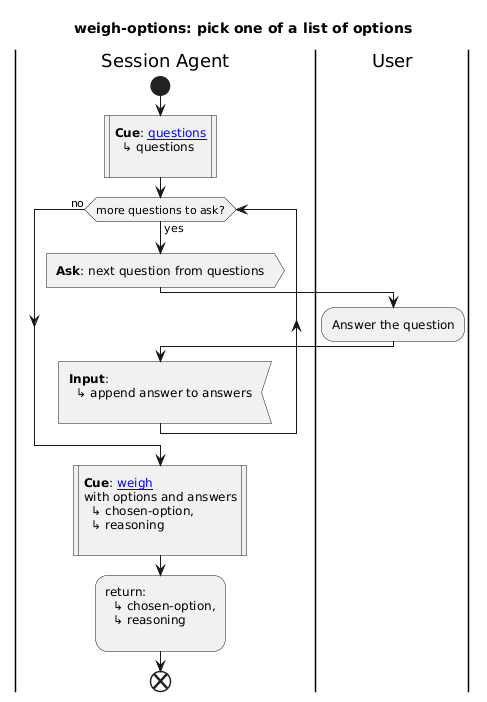

# Stagentic Promptbook (status: prototype)

A Claude Code plugin that brings PlantUML activity diagrams to skill workflows. Part of the [stagentic](#the-stagentic-family) family.

**Stagentic** — *stage + agentic* — is a family of tools by [Antony Marcano](#maintained-by) for auditioning agentic skills with automated rehearsals ([read the stagentic backstory here](https://open.substack.com/pub/antonymarcano/p/taming-claude-code-one-agentic-test)).

In theatre, a **promptbook** is the stage manager's master copy of a play: the full script alongside every cue (light, sound, scene-change, actor entrance), plus blocking, props lists, and timings. It's the operational source of truth for putting on the show — anyone who can read a promptbook can run the production from it.

`stagentic-promptbook` brings the same idea to Claude Code skills: a skill's workflow is expressed as a PlantUML activity diagram, and Claude Code follows it the way a stage manager runs a show — calling each cue in turn, branching where the diagram branches.

> **Status: prototype.** This is the experimental version of stagentic-promptbook. Keyword semantics may change before a stable release. Feedback via Issues is gold, pull-requests are platinum!

## Install

In Claude Code, add the stagentic marketplace and install the plugin:

```
/plugin marketplace add stagentic/stagentic-cc-marketplace
/plugin install stagentic-promptbook@stagentic
```

The first command is a one-time setup — once added, you can install any plugin from the [stagentic family](#the-stagentic-family) without re-adding the marketplace.

## Tested with

This plugin has been used in development with both Claude Sonnet 4.6 and Claude Opus 4.7. Sonnet currently produces the most consistent results when following the diagram — more empirical data to follow.

## What's in the box

Two skills, both namespaced under `/stagentic-promptbook:`.

### `interpreter`

The reference that lets Claude Code follow a PlantUML activity diagram as if it were the body of a skill. Defines the keyword vocabulary (`**Cue**:`, `**Run**:`, `**Await**:`, `**Inform**:`, `**Ask**:`, `**Input**:`, `**Find**:`) and the diagram constructs (swimlanes, decisions, loops, forks, sub-diagram calls, terminators).

Loaded automatically by any other PlantUML-based skill that references it. Rarely invoked on its own.

### `decisions-demo`

A small, working example skill that uses the interpreter end-to-end. Helps the user pick between 2–5 options when they can't decide. Pure conversation — no files touched, no shell, no network.

Triggers on *"help me pick"*, *"decide for me"*, or *"pick one"*.

It demonstrates:

- `|Session Agent|` and `|User|` swimlanes
- `**Ask**`, `**Input**`, `**Cue**`, `**Inform**` keywords
- A decision (`if/else/endif`) for an edge case
- A `while` loop to gather multiple answers
- A sub-diagram call (`weigh-options.puml`)
- Two cues into a single direction file via `#anchor` links
- A `:return;` from the sub-diagram back to the caller

#### What the diagram looks like

Source — the decision-logic sub-diagram (`weigh-options.puml`) that asks three questions in a loop and weighs the answers:

```plantuml
@startuml
title weigh-options: pick one of a list of options

|Session Agent|
start

:**Cue**: [[direction/prompts.md#cue-questions questions]]
  ↳ questions
; <<procedure>>

while (more questions to ask?) is (yes)
  |Session Agent|
  :**Ask**: next question from questions; <<output>>
  |User|
  :Answer the question;
  |Session Agent|
  :**Input**:
    ↳ append answer to answers
  ; <<input>>
endwhile (no)

:**Cue**: [[direction/prompts.md#cue-weigh weigh]]
with options and answers
  ↳ chosen-option,
  ↳ reasoning
; <<procedure>>

:return:
  ↳ chosen-option,
  ↳ reasoning
;
end
@enduml
```



Rendered:



Read the source under [`skills/decisions-demo/`](skills/decisions-demo/) to see how a PlantUML-based skill is structured end-to-end.

## Writing your own PlantUML-based skill

Minimum layout:

```
your-skill/
├── SKILL.md            # frontmatter + "Load the interpreter, follow the diagram"
├── your-skill.puml     # the activity diagram
└── direction/          # optional — direction files cued from the diagram
    └── ...
```

In `SKILL.md`:

```markdown
---
name: your-skill
description: ...
---

# Your Skill

1. Load the `stagentic-promptbook:interpreter` skill.
2. Follow the workflow in [your-skill.puml](your-skill.puml).
```

The body instruction `Load the stagentic-promptbook:interpreter skill` is the runtime hook — it tells Claude Code to load the interpreter before traversing the workflow. Use the fully qualified name so the plugin's interpreter is unambiguously identified, even if other PlantUML interpreters are present.

The diagram is the workflow. Direction files hold any prose that the diagram cues into. See [`skills/decisions-demo/`](skills/decisions-demo/) for a complete working example.

## Roadmap

- Acceptance tests for the interpreter constructs (TDAB-style scenarios), runnable once `stagentic-flow` ships.
- TypeScript utilities for validation, scaffolding, and linting of `.puml`-based skills.
- More example skills demonstrating different construct combinations.

## License

MIT — see [LICENSE](LICENSE).

## Maintained by

**Antony Marcano** has over 30 years in software engineering, 25 of them guiding teams in eXtreme Programming. Over the last decade he's helped companies grow development teams that ship multiple times per day, achieving the ['Elite' DORA software delivery performance](https://dora.dev/quickcheck/?v=2025&leadtime=6&deployfreq=6&failurerecovery=6&rework=1&changefailure=1&industry=all) benchmark. His current work focuses on Test-Driven Agentic Behaviours and the discipline of working with AI coding agents. Available for consulting, training, and speaking engagements.

Find Antony here: **[Substack](https://antonymarcano.substack.com) · [LinkedIn](https://www.linkedin.com/in/antonymarcano/) · [Bluesky](https://bsky.app/profile/antonymarcano.bsky.social) · [Mastodon](https://mastodon.social/@antonymarcano)**

## Support this work

The Stagentic family of free and open-source tools is a labour of love. Two ways to help it grow:

- A paid subscription to [my Substack](https://antonymarcano.substack.com) — supports the writing and thinking that feeds the tools.
- Sponsorship enquiries via [LinkedIn](https://www.linkedin.com/in/antonymarcano/).

## Acknowledgements

> Some of the inspiration for this work came from my brother, **[Raymond Rodriguez](https://www.linkedin.com/in/raymond-rodriguez-3042a532/)**. In early 2025 he built a programming-language-style DSL for his ChatGPT custom GPTs and showed me how much more reliably they ran when their instructions could be treated as code rather than prose. We talked it over many times after that. I couldn't see how to make this accessible to a wider audience, until one day I was making PlantUML diagrams to explain how my tooling worked. That's when those conversations clicked — leading to stagentic-promptbook.
>
> *— Antony Marcano*

## The stagentic family

- [`stagentic-promptbook`](https://github.com/stagentic/stagentic-promptbook) — this plugin.
- [`stagentic-flow`](https://github.com/stagentic/stagentic-flow) — TDAB runner framework (in development).
- [`stagentic-tdd`](https://github.com/stagentic/stagentic-tdd) — TDD support skill (in development).
