# Bundled skill: `decisions-demo`

This skill helps the user pick between 2–5 options when trying to make a decision. Pure conversation — no files touched, no shell, no network.

Triggers on *"Stagentic, help me pick"*, *"Stagentic, decide for me"*, or *"Stagentic, pick one"*.

It demonstrates:

- `|Session Agent|` and `|User|` swimlanes
- `**Ask**`, `**Input**`, `**Cue**`, `**Inform**` keywords
- A decision (`if/else/endif`) for an edge case
- A `while` loop to gather multiple answers
- A sub-diagram call (`weigh-options.puml`)
- Two cues into a single direction file via `#anchor` links
- A `:return;` from the sub-diagram back to the caller

## What the diagram looks like

Source — the decision-logic sub-diagram (`weigh-options.puml`) that asks three questions in a loop and weighs the answers.

The demo uses [Specification & Definition Language (SDL)](https://plantuml.com/activity-diagram-beta#bdd3477f7d5f24c6) notation.

```plantuml
@startuml
title weigh-options: pick one of a list of options

|Session Agent|
start

:**Cue**: [[direction/prompts.md#cue-questions questions]]
  ↳ questions
; <<procedure>>

while (more questions to ask?) is (yes)
  |Session Agent|
  :**Ask**: next question from questions; <<output>>
  |User|
  :Answer the question;
  |Session Agent|
  :**Input**:
    ↳ append answer to answers
  ; <<input>>
endwhile (no)

:**Cue**: [[direction/prompts.md#cue-weigh weigh]]
with options and answers
  ↳ chosen-option,
  ↳ reasoning
; <<procedure>>

:return:
  ↳ chosen-option,
  ↳ reasoning
;
end
@enduml
```

The SDL notation stereotypes such as `<<procedure>>`, `<<input>>`, `<<output>>` are for human readability only. They play no part in how the flow is interpreted (yet).

Rendered:

Read the source under [`skills/decisions-demo/`](../skills/decisions-demo/) to see how a PlantUML-based skill is structured end-to-end.
