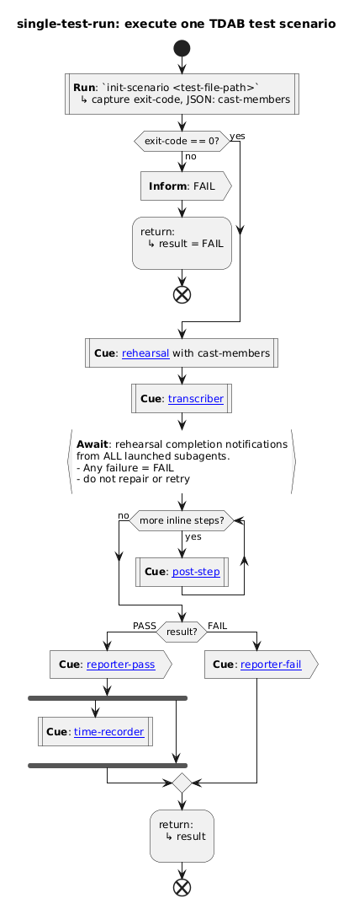
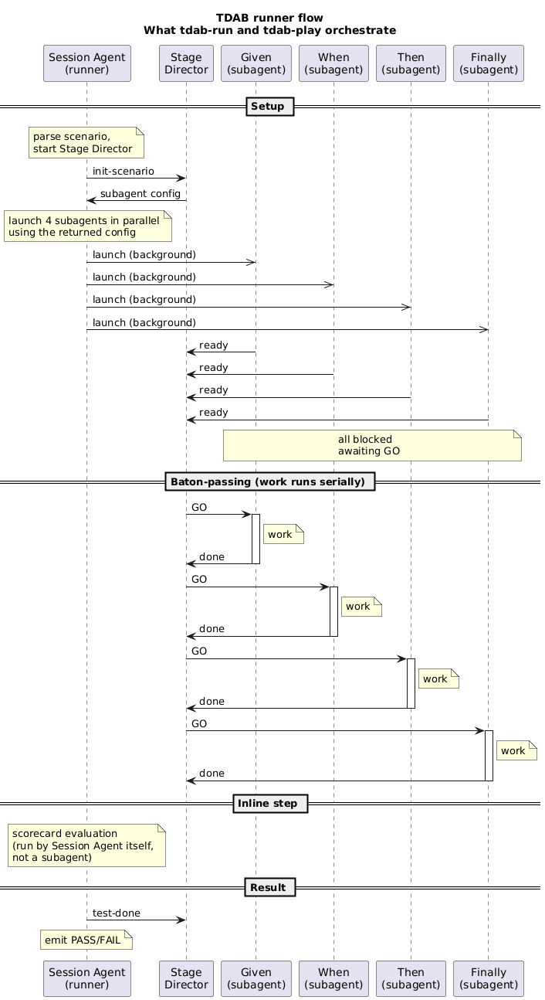
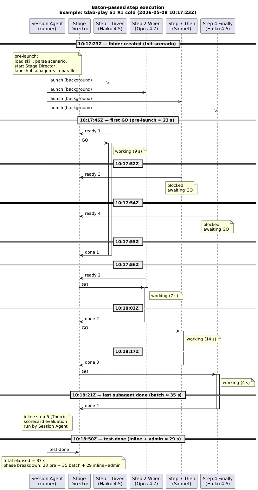

# Prose vs Promptbook preliminary analysis

**Author**: Claude (Opus 4.7), under the supervision of Antony Marcano

(AI and human authors can make mistakes — feedback welcome)

## Abstract

The working assumption, and anecdotal experience, is that UML style activity diagrams make workflows easier for people to comprehend than descriptive prose. If so, encoding a Claude skill's workflow as a PlantUML activity diagram should make the skill easier to author and read.

This analysis compares two functionally identical skills — one prose with inline constraints, one **Promptbook** (PlantUML diagrams interpreted at runtime by a shared plugin) — to answer four questions: 
* whether PlantUML can drive flow control in a Claude skill, 
* If so, if it is more or less reliable, 
* And if any benefits that may exist in the above are outweighed by it being prohibitively:
  * slower and/or
  * costlier

The Promptbook skill used the [`stagentic-promptbook`](https://github.com/stagentic/stagentic-promptbook/blob/main/README.md) plugin — a **v0 prototype interpreter** with no performance or cost optimisation attempted yet. The numbers in this doc are therefore a **baseline for future work**, not a verdict on what an optimised Promptbook interpreter could achieve. No optimisation options have been explored yet.

Evidence: 44 runs per skill across 16 sessions (interleaved chronologically between the two skills) to answer the speed and cost questions; an ablation experiment that equalises the prohibitions in each to evaluate ease of the LLM following PlantUML vs prose; a per-phase wall-clock breakdown extracted from each run's stage-director log; and per-run token usage from `session-usage` reports converted to dollar cost at Sonnet 4.6 prices.

**Findings**:

- **Functional parity**: Both skills drive the workflow successfully on every run — reliability is equivalent on this scenario.

- **Authoring effort (prohibitions)**: prose appears to require more prohibition statements – of what not to do – than the Promptbook equivalent. This can mean more runs of a prose skill while developing it in order to achieve equivalent reliability.

- **Speed**: On first 'cold' runs Promptbook's Session Agent took ~32% longer on SA-owned mean (62.4s vs 47.4s), or ~15% longer on total elapsed. Once warm — by Run 3 — per-run speeds are essentially tied, with a small advantage to Promptbook (~1% on SA-owned mean, ~4% on total elapsed mean). The cold-run premium is a one-time cost paid at session start; it is not recovered on later runs.

- **Cost**: Prose was consistently lighter — ~24% cheaper per cold run and ~18% cheaper per warm run in dollars (Sonnet 4.6, 5-min cache). Output tokens stayed ~+27–28% higher under Promptbook in both regimes, and cache reads/writes added a further +13–24% per run. **Unlike the cold-only speed premium, the cost gap is paid on every run.**

The trade-off depends on use pattern. For occasional invocation (one run per `/clear`), the cold-run premium dominates (~15% extra wall-clock, ~24% higher dollar cost). For repeated invocation in a session, speed becomes a non-issue but cost stays at ~+18% per warm run. For Pro/Max plan users, the relevant figure depends on how Anthropic counts cache reads against plan limits — not publicly documented.

All numbers above reflect the v0 interpreter — optimisation work is expected to narrow both the cold-run and per-run gaps.


## Contents

- [Working assumption](#working-assumption)
- [The questions](#the-questions)
- [What the skills being compared do](#what-the-skills-being-compared-do)
- [Findings summary table](#findings-summary-table)
    - [Q1: Can PlantUML be used for flow control?](#q1-can-plantuml-be-used-for-flow-control-in-a-claude-skill)
    - [Q2: Does PlantUML affect reliability?](#q2-does-plantuml-make-reliability-worse-better-or-equivalent)
    - [Q3: Is Promptbook faster, slower, or the same?](#q3-is-the-promptbook-approach-faster-slower-or-the-same-as-a-prose-skill)
    - [Q4: Is Promptbook costlier, cheaper, or the same?](#q4-is-the-promptbook-approach-costlier-cheaper-or-the-same-as-a-prose-skill)
- [Skill profile](#skill-profile)
    - [Q1: Functionality and footprint](#q1-functionality-and-footprint)
    - [Q2: Reliability and authoring effort](#q2-reliability-and-authoring-effort)
- [Performance & Cost](#performance--cost)
    - [Methodology](#methodology)
    - [Q3: Performance](#q3-performance)
    - [Q4: Cost](#q4-cost)
- [Conclusions](#conclusions)
- [Appendices](#appendices)
    - [Appendix A: Tokens and pricing](#appendix-a-tokens-and-pricing)
    - [Appendix B: Data](#appendix-b-data)

## Working assumption

**Humans find diagrams easier to comprehend than prose** for workflows with parallelism, branching, and dependencies — they can scan structure visually rather than reconstruct it from sentences.

This is both intuitive and consistent with Larkin & Simon (1987, [*Why a Diagram is (Sometimes) Worth Ten Thousand Words*](https://onlinelibrary.wiley.com/doi/10.1111/j.1551-6708.1987.tb00863.x), Cognitive Science 11, 65–99) and with multimedia-learning work (Mayer, *Multimedia Learning*, 2009). The UML-comprehension empirical literature (e.g., [Felderer & Herrmann 2018](https://link.springer.com/article/10.1007/s11219-018-9407-9), [Scanniello et al. 2014](https://www.sciencedirect.com/science/article/abs/pii/S1045926X14001591)) reports mixed results — confirming the *(Sometimes)* qualifier in Larkin & Simon's title: diagrams help under specific conditions (spatial layout, parallel inferences), not universally.

In short, diagrams can help reduce the cognitive load required to solve a problem. They allow users to quickly recognise features and make inferences.

This is a key basis for using UML style diagrams as workflow descriptions for Claude skills.

## The questions

Before considering the Promptbook approach as the basis for all future Stagentic Skills, the following questions must first be answered.

### 1. Can PlantUML be used for flow control in a Claude skill?

Prose is the common way to define a skill in a SKILL.md file. The first question is whether PlantUML can drive a skill's workflow instead.

The hypothesis is that the rendered diagram is what a human reads; the same `.puml` source is what the agent reads. The diagram preserves the human's structural-comprehension advantage; the source gives the agent a precise, unambiguous pseudo-code representation of the workflow.

### 2. Does PlantUML make reliability worse, better, or equivalent?

Assuming the answer to question 1 is 'yes', the second hypothesis is that PlantUML's DSL — a kind of pseudocode — will be easier for the agent to follow with less guidance on what not to do.

If this hypothesis holds, fewer iterations of running the skill during development should be required to confirm it works reliably. It also means less effort spent on prohibitive statements of what not to do, leaving more capacity to define what the agent *should* do.

### 3. Is the Promptbook approach faster, slower, or the same as a prose skill?

Speed is a potential roadblock. If a Promptbook skill is considerably slower, that could outweigh any human-readability benefits of using PlantUML as its basis – without further optimisation.

### 4. Is the Promptbook approach costlier, cheaper, or the same as a prose skill?

Cost is a potential roadblock. If a Promptbook skill is considerably more expensive, that could outweigh any human-readability benefits of using PlantUML as its basis – without further optimisation.


## What the skills being compared do

Both skills are runners for **Test-Driven Agentic Behaviour (TDAB)** — a Test-Driven Development (TDD)-based technique for testing the prompts and guidance that drive an agent's behaviours ([background](https://antonymarcano.substack.com/p/taming-claude-code-one-agentic-test)). A TDAB scenario follows a Given/When/Then/Finally pattern (motivated by regression protection — running the suite before each guidance change surfaces unintended breakage early), where each step is its own isolated agent invocation:

- **Given** — establish a clean fixture for the test.
- **When** — run the agent-under-test against a scoped prompt.
- **Then** — evaluate the outcome against a scorecard that distinguishes required constraints from scored characteristics.
- **Finally** — reset state.

The runner's responsibility is to parse the scenario, launch each step as a parallel background agent, coordinate sequencing between them via an out-of-process intermediary (the Stage Director), capture transcripts and timings, and report PASS/FAIL (these timings are what the speed analysis later uses).

Both skills share an entry point with preflight checks that branches to either a suite-run path or a single-test path. The dataset in this analysis exercised the single-test path on every run; the diagram below shows that path.



Subagents are launched in parallel but their *work* runs serially via Stage Director **baton-passing** (each subagent waits for `GO` from the director before doing its work, signals `done`, and the next gets the baton). A scenario may also include **inline** steps executed by the Session Agent itself rather than a subagent — for example, the scorecard evaluation that runs after the four subagent steps complete.



**tdab-run** and **tdab-play** are two implementations of this same responsibility. They consume the same scenario files, drive the same Stage Director, and emit the same result format. They differ only in how the runner's workflow is *encoded inside the skill*:

- **tdab-run** — a single prose `SKILL.md` with inline constraints.
- **tdab-play** — a small `SKILL.md` that fans out to PlantUML activity diagrams and direction files (small markdown files the puml diagrams reference for step-specific guidance), interpreted at runtime by the [`stagentic-promptbook`](https://github.com/stagentic/stagentic-promptbook/blob/main/README.md) plugin (a v0 prototype, no optimisation attempted).

## Findings summary table

> The tables below report findings as **prose** (tdab-run — a single prose `SKILL.md` with inline constraints) vs **Promptbook** (tdab-play — a small `SKILL.md` that fans out to PlantUML activity diagrams and direction files, interpreted at runtime by a shared Promptbook plugin).

### Q1: Can PlantUML be used for flow control in a Claude skill?

**Yes.** Both skills drive the workflow successfully on every run.

| Category | Winner | Notes                                                                                                                                                                                               |
|---|:---:|:----------------------------------------------------------------------------------------------------------------------------------------------------------------------------------------------------|
| Functional parity | draw | All 44 runs PASS for each skill                                                                                                                                                                     |
| Skill-specific payload (controlled) | draw | Within ~150 tokens of each other (~2,400 prose / ~2,550 Promptbook); Promptbook also loads a shared interpreter plugin (~1,055 tokens) that would be amortised across all Promptbook-powered skills |

### Q2: Does PlantUML make reliability worse, better, or equivalent?

**Equivalent in functional outcome; lower authoring effort under Promptbook.**

| Category | Winner | Notes |
|---|:---:|:---|
| Prohibitions | **Promptbook** | ~11 vs ~24 "do not / never / always / MUST" prohibitions in roughly equal payloads (~2.2× fewer for Promptbook); ablation surfaced supporting evidence that at least one prose prohibition is load-bearing |

### Q3: Is the Promptbook approach faster, slower, or the same as a prose skill?

**Slower on cold runs only; matches or marginally beats prose once warm.**

| Category | Winner | Notes |
|---|:---:|:---|
| Speed — cold | **prose** | prose ~32% faster on SA-owned mean (47.4s vs 62.4s); ~15% faster on total elapsed (85.8s vs 98.9s) |
| Speed — warm | draw | SA-owned means within 1% (31.6s Promptbook vs 31.8s prose); cold premium is a one-time cost paid at session start, not recovered later |
| Subagent batch | draw | 38.7s Promptbook vs 38.4s prose cold; 38.5s vs 41.5s warm — close, with a small unexplained warm asymmetry that may be sample noise |

### Q4: Is the Promptbook approach costlier, cheaper, or the same as a prose skill?

**Costlier on every run; unlike the cold-only speed premium, the cost gap is paid on every run, both cold and warm.**

| Category | Winner | Notes |
|---|:---:|:---|
| Output tokens — cold | **prose** | prose 18.9k vs Promptbook 24.2k mean (+28% Promptbook) |
| Output tokens — warm | **prose** | prose 10.1k vs Promptbook 12.8k mean (+27% Promptbook); the gap persists at the warm floor |
| Cache footprint | **prose** | Promptbook +24% cache reads cold, +15% warm; +13% cache writes cold, +15% warm |
| Total tokens / dollars — cold | **prose** | Promptbook +23% tokens / +24% dollars per run |
| Total tokens / dollars — warm | **prose** | Promptbook +15% tokens / +18% dollars per run |

**Headline trade-off**: Promptbook pays a real cold-run premium (~+15% wall-clock, ~+24% dollars) but matches or marginally beats prose on warm-run speed; the warm-run cost premium stays at ~+18%, mostly from per-turn output volume and a larger cached prefix. (At v0; optimisation work expected to narrow both gaps.)

## Skill profile

### Q1: Functionality and footprint

Both skills drove the workflow successfully on every run.

| Skill | Runs | Result |
|---|---:|:---:|
| tdab-run (prose) | 44 | 44 / 44 PASS |
| tdab-play (Promptbook) | 44 | 44 / 44 PASS |

#### Skill scope and payload

A skill's payload for this comparison is its `SKILL.md` *plus everything it references* — files within the skill folder, sub-referenced files reached transitively (e.g., direction files reached via puml `Cue` links), and any other skills loaded on the success path. The `SKILL.md` is just the entry point; the full skill surface is what gets exercised when the workflow runs.

**Scope of this comparison.** Counted: files exercised on the success path of the single-test scenario (all 88 runs PASSed). Excluded as out-of-scope (and equal across both skills):

- `AGENTS.md` — project-level policy, applies equally to both skills.
- `tdab-suites.md` — a table of contents of available suites, referenced by both skills as a fallback when the user doesn't name a test/suite explicitly. Not used in this dataset, because every prompt names the test file directly.
- `tdab-implement` skill — referenced **symmetrically** by both skills on the failure path; not exercised here since all runs PASS.

Two distinct kinds of in-scope payload arise:

- **Skill-specific** — the skill's own files (entry point + folder + sub-referenced files in the same folder).
- **Shared plugin** — a separately-installed skill loaded by the entry point. Cost amortises across every skill that uses it.

**Skill-specific payload:**

| Skill | Files | Chars | Est. tokens |
|---|---|---:|---:|
| tdab-run (prose) | 1 (SKILL.md only) | ~9,600 | ~2,400 |
| tdab-play (Promptbook) | 10 (SKILL.md + 4 puml + 5 direction) | ~10,100 | ~2,550 |

> **Shared plugin (Promptbook only).** tdab-play also loads [`stagentic-promptbook:interpreter`](https://github.com/stagentic/stagentic-promptbook) on the success path — ~4,222 chars / ~1,055 tokens. The interpreter has no further skill-side references (it defers to project policy for pause gates). Sunk cost shared by any Promptbook-style skill in the session.

The two skill-specific payloads are within ~150 tokens of each other.

>Token estimates use ~4 chars/token; treat them as ±10%.

### Q2: Reliability and authoring effort

Prohibitions are phrases like `do not`, `don't`, `never`, `always`, `must not`, `MUST`, and `no exceptions`. Some sentences pack multiple (`tdab-run/SKILL.md:52` contains four "do not"s in one sentence), so totals are counted per prohibition, not per line.

| Component | Surface | Chars | Est. tokens | Prohibitions | Per 1k chars |
|---|---|---:|---:|---:|---:|
| **tdab-run** *(skill, prose)* | SKILL.md | 9,634 | ~2,400 | ~24 | 2.5 |
| **tdab-play** *(skill, Promptbook)* | SKILL + puml + direction | 10,133 | ~2,550 | ~11 | 1.1 |
| `stagentic-promptbook:interpreter` *(shared plugin)* | SKILL.md | 4,222 | ~1,055 | 3 | 0.7 |

Two readings of the **skill-specific** comparison (interpreter excluded as it is shared):

- **SKILL.md alone**: tdab-play is slightly *denser* per char (~3.3 vs ~2.5), but tdab-run is ~8× larger so carries ~6× more prohibitions in absolute count.
- **Apples-to-apples (full skill-specific surface, ~equal size)**: tdab-run packs **~2.2× more prohibitions than tdab-play in roughly the same payload** (~24 vs ~11 in ~2,400–2,550 tokens). The puml diagrams contribute structural content (states, transitions, cue labels) without prose prohibitions, so prohibitions don't accumulate the same way.

The shared interpreter adds ~1,055 tokens and 3 prohibitions the first time any Promptbook skill runs in a session. Adding more Promptbook-style skills increases their *combined* prohibition count without increasing the interpreter's contribution — the more such skills exist, the smaller the interpreter's per-skill effective share.

Both skills share the same four high-level constraints — don't intervene, don't invent steps, don't fix up failures, don't infer CLI names. tdab-run's additional prohibitions cluster around the Session Agent flow and Report sections; tdab-play encodes those areas in `tdab-play.puml` and `direction/*.md` instead.

With total skill-specific payload size roughly matched, the surviving variables are **prose-with-prohibitions vs. structural-puml** and **single file vs. fan-out across 10 files (plus a shared plugin)** — i.e. how the same volume of instruction is shaped, and where the boundary between skill and shared infrastructure sits.

The density gap is an **early signal** of authoring effort, not a controlled measurement. A higher prohibition count means more energy spent telling the agent what *not* to do, but the count alone doesn't prove each prohibition is load-bearing. The ablation below probes that question for a specific subset.

#### Ablation result

An ablation experiment ([runbook](ablation-test-runbook.md)) was run. 13 prose prohibitions in tdab-run with no semantic equivalent in tdab-play were removed; the same single-test scenario was re-run repeatedly.

One observed deviation, surfacing on a single run after many: the runner issued ten no-op `Bash true` commands while waiting for step-done notifications between `start-transcribers` and the final step's completion — exactly the failure mode the removed clause *"After launching subagents and calling `start-transcribers`, do not run any Bash commands or take any other action. Wait silently for completion notifications."* was added to prevent. The same misbehaviour has not been observed in normal `tdab-run` use since that prohibition was authored. Given access to its own session afterwards, the runner independently identified the missing clause as the cause via `git diff`.

The asymmetry — many ablated runs to surface the deviation once vs long absence in normal use — is itself part of the evidence: these prose prohibitions are not preventing constant overt failure. They suppress low-frequency drift that is hard to spot precisely *because* it is rare. "Remove and watch it explode" would not be a faithful test of what they do.

This is supporting evidence for a representational-encoding argument, not a controlled study. One prohibition is observed load-bearing; the other ~12 did not surface deviations within the runs made — neither confirming them as load-bearing nor ruling it out. The early-signal reading of the density gap stands; the load-bearing interpretation of at least one removed prose prohibition has moved from speculation to evidence-backed.

Rendered ablation transcript: [`ablation-results/render-20260509T104807Z.md`](ablation-results/render-20260509T104807Z.md). Runbook: [`ablation-test-runbook.md`](ablation-test-runbook.md).

## Performance & Cost

### Methodology

There were two regimes for comparison – cold (pre-cached) & warm (cached). The dataset is 88 runs across 16 sessions, decomposed into two timing splits (SA-owned and Subagent batch), with analytical conventions for reading deltas.

#### Datasets

Two datasets were collected:

- **2026-05-08** — 12 sessions of 4 runs each (6 sessions per skill), interleaved chronologically between tdab-play and tdab-run. 48 runs total.
- **2026-05-09** — 4 sessions of 10 runs each (2 sessions per skill). 40 runs total. Established specifically to **validate the settled floor**: by extending sessions to 10 runs, this dataset confirms that the warm-run floor reached by Run 3 stays stable through Run 10.

Combined, the analysis uses 88 runs across 16 sessions (44 per skill). Run 1 is cold; Runs 3 & 4 are the settled-warm sample (n=16 per skill); Run 2 is excluded as transitional. The longer Runs 5–10 from the 10-run sessions are used only to demonstrate floor stability and are not aggregated into the warm averages.

#### Cold vs warm regimes

A `/clear` precedes each session: Run 1 is **cold** (prompt cache built from scratch); Runs 2–N are **warm** (prior runs' output reused from cache). The two regimes have different cost profiles and **must not be averaged together** — a combined mean is an arbitrary weighting that depends on operator usage (once per `/clear` vs many times per `/clear`). All findings below are reported per regime.

#### Definitions

- **Subagent batch** = window from first `IN ready 1` to last `IN done N`. Excludes Session Agent reasoning by definition. Within the window subagents work serially via baton-passing; the only non-serial portion is the small first-ready → first-GO gap.
- **SA-owned** = Total elapsed − Subagent batch. Includes pre-batch reading, the inline scorecard step, and post-test admin.
- **Inline scorecard** runs *after* Subagent batch and is part of SA-owned.

#### Signal hierarchy

**SA-owned** is the timing of interest — this is where skill variations show up. **Subagent batch** is only of interest to subtract from total elapsed to determine SA-owned. The subagents run identical prompts regardless of which runner launched them, so any variation inside the window is launch-order noise, not skill encoding.

#### Analytical conventions

- Every delta cited in prose derives from a single table in the same section — don't recompute deltas inline.
- When claiming a cluster or trend, every data point must fit, or the exception is called out in the same paragraph.

### Q3: Performance

#### What we measure

Each test run breaks into three measurable segments (extracted from the stage-director log) that group into two timing categories — SA-owned and Subagent batch:

```
init-scenario       first IN ready 1                 last IN done N           end of run
(start_epoch)       (subagents start)                (last subagent done)
     │                    │                                 │                      │
     ▼                    ▼                                 ▼                      ▼
     █████████████████████░░░░░░░░░░░░░░░░░░░░░░░░░░░░░░░░░░██████████████████████
     ◀──SA───────────────►◀─────── Subagent batch ─────────►◀──────── SA ────────►
```

`████` SA actively working — counted as **SA-owned**

`░░░░` SA blocked, subagents work serially via baton — counted as **Subagent batch**


#### Execution model

The four subagent steps are launched in parallel at session start, but their *work* runs **serially via Stage Director baton-passing**: each subagent calls `step-ready`, blocks awaiting `GO`, runs its work, then signals `done N`. After all subagents finish, the Session Agent runs the inline scorecard step (the test's second `Then` — executed by the runner itself, not a subagent), then signals `test-done`.



A `Finally` step's `duration_ms` is its agent lifespan (launch → terminate), so it ≈ the Subagent batch window. But `elapsed − Finally` is **not** skill overhead — it includes Session Agent pre-batch reading, the inline scorecard step (run by the SA after subagents finish), and post-batch admin (`session-usage`, `update-benchmark`, result-table emission). The headline split below — SA-owned vs Subagent batch — separates these out.

>**Session Agent model.** All dataset runs used Sonnet as the Session Agent. The Session-Agent-bound phases (pre-batch reading and the inline scorecard step, both part of SA-owned) scale with the chosen Session Agent model — running the same scenario with Opus, for instance, would inflate those phases substantially while leaving the Subagent batch window roughly unchanged. Relative deltas between the two skills remain valid because both ran with the same Session Agent.

#### Cold runs

Run 1 of each session — `/clear` precedes, prompt cache built from scratch. n=8 sessions per skill.

| Metric | tdab-play | tdab-run | Δ (play vs run) |
|---|---:|---:|---:|
| Mean total elapsed | 98.9s | 85.8s | **+15%** |
| Median total elapsed | 92s | 84s | **+10%** |
| Range (total) | 83–123s | 70–105s | — |
| Mean SA-owned | 62.4s | 47.4s | **+32%** |
| Median SA-owned | 57s | 46.5s | **+23%** |
| Range (SA-owned) | 51–77s | 35–65s | — |

*Subagent batch: 38.7s play vs 38.4s run — essentially identical, validating that the batch window does not depend on the runner.*

*tdab-play SA-owned is n=7 (one session has a missing batch start event); all other stats are n=8.*

Skill-specific payload sizes are within 150 tokens of each other (~2,400 vs ~2,550), so the cold cost isn't explained by raw reading volume — the Promptbook's fan-out across 10 files plus the interpreter plugin (~1,055 tokens) is the more plausible driver, but this dataset can't isolate that.

**Finding (cold).**

- Promptbook is **~32% slower on SA-owned mean** (62.4s vs 47.4s); the median gap is smaller (+23%) because two slower play sessions (74s, 77s) lift its mean.
- On total elapsed, the gap shrinks to **~15% mean / ~10% median**, because both skills wait through the same ~38s subagent batch window.
- The SA-owned overhead is the cost the Session Agent pays before subagents take over — loading the skill, reading workflow files, planning the batch.
- Whether it is prohibitive depends on use pattern: bearable for occasional invocation, more visible if every session triggers it once.

#### Warm runs

Both skills converge to a settled floor by Run 3. SA-owned mean by run position (n=8 sessions per skill, except cold for tdab-play which is n=7):

| Position | tdab-play | tdab-run |
|---|---:|---:|
| Run 1 (cold) | 62.4s | 47.4s |
| Run 2 (transitional) | 35.6s | 33.8s |
| Run 3 (settled) | 31.6s | 32.8s |
| Run 4 (settled) | 31.6s | 30.8s |

Run 2 sits ~3–5s above the floor for both skills and is excluded from warm averages as transitional. **Warm = Runs 3 & 4** across all sessions, n=16 per skill. The longer 10-run sessions in the dataset confirm the floor stays stable from Run 3 through Run 10.

| Metric | tdab-play | tdab-run | Δ (play vs run) |
|---|---:|---:|---:|
| Mean total elapsed | 70.1s | 73.3s | **−4%** |
| Median total elapsed | 68.5s | 69.5s | **−1%** |
| Range (total) | 63–81s | 62–100s | — |
| Mean SA-owned | 31.6s | 31.8s | **−1%** |
| Median SA-owned | 31s | 31s | **0%** |
| Range (SA-owned) | 27–40s | 25–42s | — |

*Subagent batch: 38.5s play vs 41.5s run — close, with run carrying one outlier (68s) that lifts its mean.*

**Finding (warm).**

- At the settled floor, the per-run speeds are **essentially tied with a small advantage to tdab-play**: SA-owned 31.6s vs 31.8s (means within 0.2s, medians identical at 31s); total elapsed 70.1s vs 73.3s mean (~4%).
- The cold-run SA-owned premium (~+15s extra for tdab-play on Run 1) is a **one-time cost paid at session start**, not recovered on later runs — per-run rates are too close to make it up.
- The cumulative SA-owned deficit therefore **persists indefinitely** but shrinks as a fraction of total session time as more runs are added.
- Speed cost of the Promptbook is concentrated entirely in the cold run; once warm, there is no meaningful per-run speed difference.

### Q4: Cost

#### What we measure

Each run reports four token types from `session-usage`: **input**, **output**, **cache write** (5-minute), and **cache read**. Two views are reported below: raw tokens (relevant when usage caps are measured in tokens, e.g. Max plan) and dollars (Sonnet 4.6 prices). For the explanation of each type and the prices used, see [Appendix A: Tokens and pricing](#appendix-a-tokens-and-pricing).

Input tokens are always under 60 per run for both skills and are omitted from per-component tables.

>**Cache reads grow with session position.** Each turn re-reads the entire cached prefix (skill content + accumulating conversation history), so per-run cache-read costs depend on **where in the session** the run sits, not just on the skill. The warm averages below reflect Runs 3 & 4 (the two settled positions available across every session in the dataset). For longer sessions, per-run cache-read costs would keep climbing.

#### Cold runs

Run 1 of each session — `/clear` precedes, prompt cache built from scratch. n=8 per skill.

**Tokens (mean per run)**

| Component | tdab-play | tdab-run | Δ (play vs run) |
|---|---:|---:|---:|
| Output | 24,180 | 18,873 | **+28%** |
| Cache write | 37,710 | 33,357 | +13% |
| Cache read | 1,132,952 | 915,955 | **+24%** |
| **Total** | **1,194,889** | **968,235** | **+23%** |

**Dollars (mean per run, Sonnet 4.6)**

| Component | tdab-play | tdab-run | Δ |
|---|---:|---:|---:|
| Output | $0.363 | $0.283 | +28% |
| Cache write | $0.141 | $0.125 | +13% |
| Cache read | $0.340 | $0.275 | +24% |
| **Total** | **$0.844** | **$0.683** | **+24%** |

**Finding (cold).**

- tdab-play uses **+23% more total tokens** on the first run after `/clear` (~1.19M vs ~0.97M).
- Output tokens are +28% higher; cache reads +24%; cache writes +13%.
- This translates to **~24% higher dollar cost** per run (~$0.84 vs ~$0.68), assuming Sonnet 4.6 with 5-minute cache.
- Plausibly the cost of loading the larger first-time payload — interpreter plugin (~1,055 tokens) plus 10 fan-out files vs a single SKILL.md.

#### Warm runs

Runs 3 & 4 across all sessions, n=16 per skill. Run 2 is excluded as transitional, matching the Performance section's settled-floor definition.

**Tokens (mean per run)**

| Component | tdab-play | tdab-run | Δ (play vs run) |
|---|---:|---:|---:|
| Output | 12,763 | 10,087 | **+27%** |
| Cache write | 23,165 | 20,146 | +15% |
| Cache read | 1,242,583 | 1,085,108 | +15% |
| **Total** | **1,278,545** | **1,115,375** | **+15%** |

**Dollars (mean per run, Sonnet 4.6)**

| Component | tdab-play | tdab-run | Δ |
|---|---:|---:|---:|
| Output | $0.191 | $0.151 | +27% |
| Cache write | $0.087 | $0.076 | +15% |
| Cache read | $0.373 | $0.326 | +15% |
| **Total** | **$0.651** | **$0.552** | **+18%** |

**Finding (warm).**

- Unlike speed (which fully amortises by Run 3), the **token gap persists** at +15% per warm run (~1.28M vs ~1.12M).
- **Output tokens are +27% higher** for tdab-play even at the warm floor — the Session Agent generates more text per turn under Promptbook interpretation, despite finishing in roughly the same wall-clock time.
- Cache reads and cache writes are both **+15%** — the larger cached prefix is read and refreshed every turn.
- In dollars: **+18% per warm run** (~$0.65 vs ~$0.55) — slightly higher than the token gap because the +27% output difference weighs more in dollars (output is 5× the input rate, vs cache-read which is 0.1×).

#### Plan implications

Whether the cost difference matters depends on how a user is billed. Anthropic does not publicly document exactly how different token types count toward Pro / Max plan limits, so this subsection translates the analysis above into the most likely outcomes per plan tier.

**API (pay-as-you-go)** — cost is the dollar figure: **+24% per cold run, +18% per warm run** (Sonnet 4.6, 5-min cache).

**Pro and Max plans (usage-bounded)** — Anthropic measures Claude Code usage against a **shared 5-hour rolling window plus weekly caps**. Limits are described in relative terms (Max 5x = "5× Pro per session", Max 20x = "20× Pro per session") rather than fixed token counts. Third-party measurements estimate per-window allowances at roughly:

| Plan | Per 5-hour window (third-party estimate) |
|---|---|
| Pro | ~40–45 messages, or ~44k tokens |
| Max 5x ($100/mo) | ~225 messages, or ~88k tokens |
| Max 20x ($200/mo) | ~900 messages, or ~220k tokens |

The relevant Δ between the two skills depends on the accounting model:

| If usage is measured by… | Δ play vs run, cold | Δ play vs run, warm |
|---|---:|---:|
| Total tokens (all types weighted equally) | **+23%** | **+15%** |
| Output tokens only | +28% | +27% |
| Dollar-equivalent (mirroring API pricing weights) | +24% | +18% |

*If a plan discounts cache reads, the effective gap moves toward the Output-tokens row.*

Across cold + Runs 3 & 4 (3 runs of reported data), tdab-play totals ~3.75M tokens vs ~3.21M for tdab-run — about **+17% more across the reported runs** measured by total tokens.

Practical takeaways:

- Unlike speed, the **cost gap does not collapse on warm runs**. It moderates from cold to warm but stays in the +15% to +27% range across all accounting models on warm runs.
- **Output tokens are the most stable signal** — ~+27–28% on both cold and warm. The Session Agent generates measurably more text per turn under Promptbook interpretation, regardless of cache state.
- The **total-token** gap is dominated by cache reads on warm runs (since cache reads are ~85% of warm-run tokens), so any plan that heavily discounts cache reads will see a smaller effective gap closer to the output figure.
- For Pro and Max 5x users running TDAB suites repeatedly inside a 5-hour window, the per-run differences accumulate against the per-window allowance — this is where Promptbook's overhead is most felt in practice.

References for plan limits, as seen on 2026-05-09:
- [Claude Max plan overview](https://support.claude.com/en/articles/11049741-what-is-the-max-plan)
- [Using Claude Code with your Pro or Max plan](https://support.claude.com/en/articles/11145838-using-claude-code-with-your-pro-or-max-plan)
- [How do usage and length limits work?](https://support.claude.com/en/articles/11647753-how-do-usage-and-length-limits-work)
- [Claude Code Token Limits: A Guide for Engineering Leaders](https://www.faros.ai/blog/claude-code-token-limits) (third-party, source for per-window token estimates)

## Conclusions

Based on the testing and analysis above, the answers to the four questions:

**Q1 — Can PlantUML drive flow control? Yes.**
- Both skills drove the workflow successfully on every run — 44/44 PASS for each across 16 sessions on the same scenario.

**Q2 — Does PlantUML affect reliability? Equivalent at runtime, with lower authoring effort.**
- The Promptbook encoding required ~2.2× fewer prohibitions in roughly equal payloads (~11 vs ~24 in ~2,400–2,550 tokens).
- All 13 ablated prohibitions had originally been added in response to past intermittent agent misbehaviour. Ablation directly confirmed one prose prohibition as load-bearing; the other ~12 didn't surface deviations in the runs made. Further runs were not carried out due to time and cost constraints.

**Q3 — Faster, slower, or the same? Slower on the first cold run only; tied or marginally faster once warm.**
- Run 1: Promptbook's Session Agent took ~32% longer on SA-owned mean (62.4s vs 47.4s) and ~15% longer on total elapsed.
- From Run 3 onward, per-run speeds are essentially tied (within 1% on SA-owned mean).
- The cold-run premium is paid once per session, not recovered on later runs.

**Q4 — Costlier, cheaper, or the same? Costlier on every run.**
- Promptbook was ~+24% more expensive per cold run and ~+18% per warm run in dollars (Sonnet 4.6, 5-min cache).
- Output tokens were ~+27–28% higher in both regimes — the most stable cost gap.
- Unlike the cold-only speed premium, the cost gap is paid on every run.

**Synthesis.**
- Promptbook wins on authoring effort and matches prose at runtime once warm.
- It pays a one-time wall-clock premium at session start and a per-run cost premium across the session.
- Whether the trade-off is worth it depends on use pattern and how cost is accounted for: occasional invocation per `/clear` magnifies the cold premium; frequent invocation magnifies the per-run cost; plans that discount cache reads narrow the cost gap toward the ~+27% output-token figure.

**Caveat.**
- All numbers reflect the v0 Promptbook interpreter, with no optimisation attempted.
- Both the cold-run and per-run gaps are expected to narrow with optimisation work; this analysis is a baseline for that work, not a verdict.

## Appendices

### Appendix A: Tokens and pricing

#### The four token types reported per run

Each run's `session-usage` report includes four token counts:

- **Input** — fresh tokens sent to the model in the request, excluding cached content. Negligible in this dataset (under 60 per run).
- **Output** — tokens generated by the model.
- **Cache write** — tokens stored in the prompt cache on this turn. Two cache TTLs exist (5-minute and 1-hour); this dataset assumes 5-minute, since runs in a session are seconds apart and the longer TTL would not pay off.
- **Cache read** — tokens read from the prompt cache on this turn (cached prefix from prior turns). Grows monotonically through a session, because each turn re-reads everything cached so far including accumulating conversation history.

#### Sonnet 4.6 API pricing

The Session Agent in this dataset is Claude Sonnet 4.6. Per-million-token prices:

| Token type | Price (per MTok) |
|---|---:|
| Input | $3 |
| Output | $15 |
| Cache write (5-minute) | $3.75 |
| Cache write (1-hour) | $6 |
| Cache read | $0.30 |

Per-run dollar cost is computed as:

```
cost = input × $3/M + output × $15/M + cache_write × $3.75/M + cache_read × $0.30/M
```

Prompt-caching prices are documented as multipliers on the base input price: 5-minute cache write is 1.25× input, 1-hour cache write is 2× input, cache read is 0.10× input. Output is 5× the input price.

Source: Anthropic API pricing documentation, [https://platform.claude.com/docs/en/about-claude/pricing](https://platform.claude.com/docs/en/about-claude/pricing) — as seen on 2026-05-09.

### Appendix B: Data

Test: `agentic-tdab-spec/behaviours/subagent-steps/subagent-steps-test.md`

#### 2026-05-08 dataset (12 sessions × 4 runs)

##### 2026-05-08 10:17 UTC — tdab-play

`/clear`

`/tdab-play`

`Run scenario: subagent-steps-test.md 4 times; stop on fail.`

**Summary**

| Run | Result | Elapsed | Input tokens | Output tokens | Cache read tokens | Cache write tokens |
|---|---|---|---|---|---|---|
| 1 | PASS | 1m 32s | 44 | 25676 | 1119371 | 38494 |
| 2 | PASS | 1m 18s | 40 | 15773 | 1286934 | 33271 |
| 3 | PASS | 1m 5s | 36 | 13710 | 1308792 | 23944 |
| 4 | PASS | 1m 12s | 36 | 13541 | 1522078 | 24268 |

**Subagent batch (from stage-director)**

| Run | Start | End | Duration (s) |
|---|---|---|---|
| 1 | 10:17:46Z | 10:18:21Z | 35 |
| 2 | 10:19:23Z | 10:20:00Z | 37 |
| 3 | 10:20:50Z | 10:21:28Z | 38 |
| 4 | 10:22:11Z | 10:22:48Z | 37 |
| **Avg** | — | — | **37** |

##### 2026-05-08 10:27 UTC — tdab-run

`/clear`

`/tdab-run`

`Run scenario: subagent-steps-test.md 4 times; stop on fail.`

**Summary**

| Run | Result | Elapsed | Input tokens | Output tokens | Cache read tokens | Cache write tokens |
|---|---|---|---|---|---|---|
| 1 | PASS | 1m 10s | 55 | 17744 | 900148 | 31480 |
| 2 | PASS | 1m 4s | 32 | 13881 | 918930 | 24984 |
| 3 | PASS | 1m 7s | 29 | 12775 | 971992 | 22373 |
| 4 | PASS | 1m 2s | 28 | 12856 | 1097075 | 21266 |

**Subagent batch (from stage-director)**

| Run | Start | End | Duration (s) |
|---|---|---|---|
| 1 | 10:28:08Z | 10:28:43Z | 35 |
| 2 | 10:29:41Z | 10:30:09Z | 28 |
| 3 | 10:30:47Z | 10:31:22Z | 35 |
| 4 | 10:32:03Z | 10:32:37Z | 34 |
| **Avg** | — | — | **33** |

##### 2026-05-08 10:36 UTC — tdab-play

`/clear`

`/tdab-play`

`Run scenario: subagent-steps-test.md 4 times; stop on fail.`

**Summary**

| Run | Result | Elapsed | Input tokens | Output tokens | Cache read tokens | Cache write tokens |
|---|---|---|---|---|---|---|
| 1 | PASS | 1m 32s | 43 | 26231 | 1094047 | 37841 |
| 2 | PASS | 1m 4s | 42 | 14650 | 1200110 | 29501 |
| 3 | PASS | 1m 9s | 34 | 14052 | 1193555 | 25180 |
| 4 | PASS | 1m 3s | 34 | 13933 | 1393151 | 24943 |

**Subagent batch (from stage-director)**

| Run | Start | End | Duration (s) |
|---|---|---|---|
| 1 | 10:36:34Z | 10:37:11Z | 37 |
| 2 | 10:38:18Z | 10:38:52Z | 34 |
| 3 | 10:39:32Z | 10:40:13Z | 41 |
| 4 | 10:40:52Z | 10:41:28Z | 36 |
| **Avg** | — | — | **37** |

##### 2026-05-08 10:43 UTC — tdab-run

`/clear`

`/tdab-run`

`Run scenario: subagent-steps-test.md 4 times; stop on fail.`

**Summary**

| Run | Result | Elapsed | Input tokens | Output tokens | Cache read tokens | Cache write tokens |
|---|---|---|---|---|---|---|
| 1 | PASS | 1m 30s | 48 | 17405 | 872466 | 31063 |
| 2 | PASS | 1m 18s | 33 | 9264 | 784430 | 21285 |
| 3 | PASS | 1m 19s | 29 | 8635 | 865142 | 17187 |
| 4 | PASS | 1m 9s | 29 | 8696 | 1022962 | 17439 |

**Subagent batch (from stage-director)**

| Run | Start | End | Duration (s) |
|---|---|---|---|
| 1 | 10:44:00Z | 10:44:46Z | 46 |
| 2 | 10:45:45Z | 10:46:29Z | 44 |
| 3 | 10:47:14Z | 10:47:55Z | 41 |
| 4 | 10:48:44Z | 10:49:22Z | 38 |
| **Avg** | — | — | **42** |

##### 2026-05-08 11:02 UTC — tdab-play

`/clear`

`/tdab-play`

`Run scenario: subagent-steps-test.md 4 times; stop on fail.`

**Summary**

| Run | Result | Elapsed | Input tokens | Output tokens | Cache read tokens | Cache write tokens |
|---|---|---|---|---|---|---|
| 1 | PASS | 1m 50s | 42 | 22231 | 1011362 | 35259 |
| 2 | PASS | 1m 6s | 40 | 15848 | 1135104 | 33051 |
| 3 | PASS | 1m 6s | 35 | 14674 | 1200300 | 29373 |
| 4 | PASS | 1m 8s | 35 | 14761 | 1396395 | 28915 |

**Subagent batch (from stage-director)**

| Run | Start | End | Duration (s) |
|---|---|---|---|
| 1 | 10:56:08Z | 10:56:44Z | 36 |
| 2 | 10:58:15Z | 10:58:49Z | 34 |
| 3 | 10:59:29Z | 11:00:04Z | 35 |
| 4 | 11:00:42Z | 11:01:21Z | 39 |
| **Avg** | — | — | **36** |

##### 2026-05-08 11:17 UTC — tdab-run

`/clear`

`/tdab-run`

`Run scenario: subagent-steps-test.md 4 times; stop on fail.`

**Summary**

| Run | Result | Elapsed | Input tokens | Output tokens | Cache read tokens | Cache write tokens |
|---|---|---|---|---|---|---|
| 1 | PASS | 1m 18s | 54 | 19784 | 936208 | 33393 |
| 2 | PASS | 1m 10s | 37 | 14163 | 966352 | 25456 |
| 3 | PASS | 1m 5s | 33 | 9011 | 993562 | 18256 |
| 4 | PASS | 1m 2s | 39 | 9667 | 1302641 | 18753 |

**Subagent batch (from stage-director)**

| Run | Start | End | Duration (s) |
|---|---|---|---|
| 1 | 11:18:11Z | 11:18:50Z | 39 |
| 2 | 11:19:39Z | 11:20:18Z | 39 |
| 3 | 11:20:56Z | 11:21:36Z | 40 |
| 4 | 11:22:15Z | 11:22:47Z | 32 |
| **Avg** | — | — | **38** |

##### 2026-05-08 11:27 UTC — tdab-play

`/clear`

`/tdab-play`

`Run scenario: subagent-steps-test.md 4 times; stop on fail.`

**Summary**

| Run | Result | Elapsed | Input tokens | Output tokens | Cache read tokens | Cache write tokens |
|---|---|---|---|---|---|---|
| 1 | PASS | 1m 23s | 46 | 19669 | 962993 | 33446 |
| 2 | PASS | 1m 12s | 36 | 13875 | 955372 | 29808 |
| 3 | PASS | 1m 18s | 30 | 13123 | 1030194 | 24560 |
| 4 | PASS | 1m 15s | 30 | 13310 | 1200856 | 24039 |

**Subagent batch (from stage-director)**

| Run | Start | End | Duration (s) |
|---|---|---|---|
| 1 | — | 11:28:19Z | — *(missing leading events; see Caveats)* |
| 2 | 11:29:20Z | 11:29:58Z | 38 |
| 3 | 11:30:39Z | 11:31:17Z | 38 |
| 4 | 11:32:03Z | 11:32:45Z | 42 |
| **Avg (R2–R4)** | — | — | **39** |

##### 2026-05-08 11:39 UTC — tdab-run

`/clear`

`/tdab-run`

`Run scenario: subagent-steps-test.md 4 times; stop on fail.`

**Summary**

| Run | Result | Elapsed | Input tokens | Output tokens | Cache read tokens | Cache write tokens |
|---|---|---|---|---|---|---|
| 1 | PASS | 1m 42s | 45 | 18424 | 981650 | 33419 |
| 2 | PASS | 1m 17s | 38 | 9183 | 844577 | 20581 |
| 3 | PASS | 1m 21s | 34 | 9012 | 1036401 | 19215 |
| 4 | PASS | 1m 13s | 36 | 9100 | 1223406 | 18599 |

**Subagent batch (from stage-director)**

| Run | Start | End | Duration (s) |
|---|---|---|---|
| 1 | 11:39:39Z | 11:40:23Z | 44 |
| 2 | 11:41:35Z | 11:42:18Z | 43 |
| 3 | 11:43:10Z | 11:43:52Z | 42 |
| 4 | 11:44:47Z | 11:45:26Z | 39 |
| **Avg** | — | — | **42** |

##### 2026-05-08 12:05 UTC — tdab-run

`/clear`

`/tdab-run`

`Run scenario: subagent-steps-test.md 4 times; stop on fail.`

**Summary**

| Run | Result | Elapsed | Input tokens | Output tokens | Cache read tokens | Cache write tokens |
|---|---|---|---|---|---|---|
| 1 | PASS | 1m 13s | 51 | 19030 | 974736 | 30335 |
| 2 | PASS | 1m 9s | 36 | 11551 | 938692 | 22647 |
| 3 | PASS | 1m 9s | 33 | 9044 | 1002202 | 17928 |
| 4 | PASS | 1m 14s | 34 | 9216 | 1238111 | 18374 |

**Subagent batch (from stage-director)**

| Run | Start | End | Duration (s) |
|---|---|---|---|
| 1 | 12:00:03Z | 12:00:37Z | 34 |
| 2 | 12:01:32Z | 12:02:12Z | 40 |
| 3 | 12:02:49Z | 12:03:30Z | 41 |
| 4 | 12:04:08Z | 12:04:54Z | 46 |
| **Avg** | — | — | **40** |

##### 2026-05-08 12:07 UTC — tdab-play

`/clear`

`/tdab-play`

`Run scenario: subagent-steps-test.md 4 times; stop on fail.`

**Summary**

| Run | Result | Elapsed | Input tokens | Output tokens | Cache read tokens | Cache write tokens |
|---|---|---|---|---|---|---|
| 1 | PASS | 1m 32s | 43 | 20883 | 1047593 | 35430 |
| 2 | PASS | 1m 11s | 40 | 15856 | 1143722 | 32140 |
| 3 | PASS | 1m 4s | 33 | 13117 | 1087910 | 23758 |
| 4 | PASS | 1m 4s | 33 | 13083 | 1266087 | 23344 |

**Subagent batch (from stage-director)**

| Run | Start | End | Duration (s) |
|---|---|---|---|
| 1 | 12:07:18Z | 12:07:59Z | 41 |
| 2 | 12:09:08Z | 12:09:44Z | 36 |
| 3 | 12:10:29Z | 12:11:01Z | 32 |
| 4 | 12:11:39Z | 12:12:14Z | 35 |
| **Avg** | — | — | **36** |

##### 2026-05-08 12:21 UTC — tdab-play

`/clear`

`/tdab-play`

`Run scenario: subagent-steps-test.md 4 times; stop on fail.`

**Summary**

| Run | Result | Elapsed | Input tokens | Output tokens | Cache read tokens | Cache write tokens |
|---|---|---|---|---|---|---|
| 1 | PASS | 1m 32s | 50 | 19932 | 1059223 | 36496 |
| 2 | PASS | 1m 16s | 42 | 15110 | 1018038 | 30199 |
| 3 | PASS | 1m 16s | 33 | 13996 | 1060125 | 25742 |
| 4 | PASS | 1m 21s | 37 | 13818 | 1370854 | 25176 |

**Subagent batch (from stage-director)**

| Run | Start | End | Duration (s) |
|---|---|---|---|
| 1 | 12:21:37Z | 12:22:17Z | 40 |
| 2 | 12:23:26Z | 12:24:09Z | 43 |
| 3 | 12:24:49Z | 12:25:34Z | 45 |
| 4 | 12:26:14Z | 12:26:59Z | 45 |
| **Avg** | — | — | **43** |

##### 2026-05-08 12:30 UTC — tdab-run

`/clear`

`/tdab-run`

`Run scenario: subagent-steps-test.md 4 times; stop on fail.`

**Summary**

| Run | Result | Elapsed | Input tokens | Output tokens | Cache read tokens | Cache write tokens |
|---|---|---|---|---|---|---|
| 1 | PASS | 1m 45s | 50 | 18296 | 872315 | 34824 |
| 2 | PASS | 1m 27s | 37 | 14006 | 866567 | 29974 |
| 3 | PASS | 1m 26s | 29 | 12803 | 967827 | 21938 |
| 4 | PASS | 1m 40s | 38 | 13482 | 1318659 | 27888 |

**Subagent batch (from stage-director)**

| Run | Start | End | Duration (s) |
|---|---|---|---|
| 1 | 12:31:06Z | 12:31:46Z | 40 |
| 2 | 12:33:07Z | 12:33:50Z | 43 |
| 3 | 12:34:52Z | 12:35:36Z | 44 |
| 4 | 12:36:31Z | 12:37:39Z | 68 |
| **Avg** | — | — | **49** |

#### 2026-05-09 dataset (4 sessions × 10 runs)

##### 2026-05-09 08:06 UTC — tdab-play

`/clear`

`/tdab-play`

`From suite 1, run: subagent-steps-test.md 10 times; stop on fail.`

**Summary**

| Run | Result | Elapsed | Input tokens | Output tokens | Cache read tokens | Cache write tokens |
|---|---|---|---|---|---|---|
| 1 | PASS | 1m 47s | 50 | 32072 | 1257667 | 42780 |
| 2 | PASS | 1m 17s | 44 | 12298 | 1145191 | 28164 |
| 3 | PASS | 1m 4s | 39 | 12099 | 1291243 | 26449 |
| 4 | PASS | 1m 3s | 31 | 9212 | 1356759 | 20112 |
| 5 | PASS | 0m 58s | 32 | 8859 | 1466802 | 17282 |
| 6 | PASS | 1m 15s | 38 | 9113 | 1815796 | 20586 |
| 7 | PASS | 1m 12s | 31 | 8955 | 1714549 | 16885 |
| 8 | PASS | 1m 12s | 37 | 9532 | 2097329 | 24224 |
| 9 | PASS | 1m 10s | 37 | 9613 | 2282294 | 24014 |
| 10 | PASS | 1m 16s | 37 | 9598 | 2465965 | 24159 |

**Batched Subagent Runtime**

| Run | `IN ready 1` | `IN done 4` | Runtime |
|---|---|---|---|
| 1 | 08:07:02Z | 08:07:38Z | 36s |
| 2 | 08:09:02Z | 08:09:41Z | 39s |
| 3 | 08:10:22Z | 08:10:58Z | 36s |
| 4 | 08:11:42Z | 08:12:11Z | 29s |
| 5 | 08:12:46Z | 08:13:19Z | 33s |
| 6 | 08:13:55Z | 08:14:37Z | 42s |
| 7 | 08:15:20Z | 08:15:58Z | 38s |
| 8 | 08:16:40Z | 08:17:21Z | 41s |
| 9 | 08:17:59Z | 08:18:39Z | 40s |
| 10 | 08:19:18Z | 08:19:59Z | 41s |

##### 2026-05-09 09:28 UTC — tdab-run

`/clear`

`/tdab-run`

`From suite 1, run: subagent-steps-test.md 10 times; stop on fail.`

**Summary**

| Run | Result | Elapsed | Input tokens | Output tokens | Cache read tokens | Cache write tokens |
|---|---|---|---|---|---|---|
| 1 | PASS | 1m 20s | 48 | 17436 | 885411 | 34385 |
| 2 | PASS | 1m 7s | 35 | 9540 | 803142 | 23850 |
| 3 | PASS | 1m 7s | 35 | 9477 | 979908 | 24214 |
| 4 | PASS | 1m 20s | 35 | 9414 | 1159426 | 23274 |
| 5 | PASS | 1m 12s | 33 | 9200 | 1333353 | 20643 |
| 6 | PASS | 1m 17s | 32 | 9023 | 1432230 | 20586 |
| 7 | PASS | 1m 23s | 32 | 9137 | 1599634 | 20396 |
| 8 | PASS | 1m 15s | 32 | 9013 | 1766640 | 20655 |
| 9 | PASS | 1m 10s | 35 | 9155 | 2045467 | 18274 |
| 10 | PASS | 1m 12s | 32 | 9078 | 2103900 | 20079 |

**Batched Subagent Runtime**

| Run | `IN ready 1` | `IN done 4` | Runtime |
|---|---|---|---|
| 1 | 09:28:27Z | 09:28:57Z | 30s |
| 2 | 09:29:58Z | 09:30:37Z | 39s |
| 3 | 09:31:14Z | 09:31:53Z | 39s |
| 4 | 09:32:33Z | 09:33:22Z | 49s |
| 5 | 09:34:02Z | 09:34:43Z | 41s |
| 6 | 09:35:25Z | 09:36:05Z | 40s |
| 7 | 09:36:47Z | 09:37:38Z | 51s |
| 8 | 09:38:22Z | 09:39:03Z | 41s |
| 9 | 09:39:52Z | 09:40:23Z | 31s |
| 10 | 09:41:02Z | 09:41:43Z | 41s |

##### 2026-05-09 10:17 UTC — tdab-play

`/clear`

`/tdab-play`

`From suite 1, run: subagent-steps-test.md 10 times; stop on fail.`

**Summary**

| Run | Result | Elapsed | Input tokens | Output tokens | Cache read tokens | Cache write tokens |
|---|---|---|---|---|---|---|
| 1 | PASS | 2m 3s | 57 | 26747 | 1511359 | 41935 |
| 2 | PASS | 1m 24s | 38 | 10102 | 1014017 | 16229 |
| 3 | PASS | 1m 13s | 30 | 9009 | 1082031 | 10850 |
| 4 | PASS | 1m 21s | 28 | 8770 | 1120995 | 9992 |
| 5 | PASS | 1m 20s | 32 | 9053 | 1422838 | 13601 |
| 6 | PASS | 1m 22s | 31 | 9059 | 1511081 | 13355 |
| 7 | PASS | 1m 19s | 32 | 9130 | 1766339 | 13666 |
| 8 | PASS | 1m 18s | 32 | 9122 | 1936971 | 13712 |
| 9 | PASS | 1m 19s | 22 | 11395 | 1865532 | 20455 |
| 10 | PASS | 1m 18s | 38 | 9371 | 2546391 | 14477 |

**Batched Subagent Runtime**

| Run | `IN ready 1` | `IN done 4` | Runtime |
|---|---|---|---|
| 1 | 10:18:24Z | 10:19:10Z | 46s |
| 2 | 10:20:22Z | 10:21:04Z | 42s |
| 3 | 10:21:54Z | 10:22:31Z | 37s |
| 4 | 10:23:16Z | 10:24:07Z | 51s |
| 5 | 10:24:46Z | 10:25:25Z | 39s |
| 6 | 10:26:19Z | 10:27:10Z | 51s |
| 7 | 10:27:52Z | 10:28:30Z | 38s |
| 8 | 10:29:23Z | 10:29:58Z | 35s |
| 9 | 10:30:47Z | 10:31:30Z | 43s |
| 10 | 10:32:18Z | 10:32:55Z | 37s |

##### 2026-05-09 16:16 UTC — tdab-run

`/clear`

`/tdab-run`

`From suite 1, run: subagent-steps-test.md 10 times; stop on fail.`

**Summary**

| Run | Result | Elapsed | Input tokens | Output tokens | Cache read tokens | Cache write tokens |
|---|---|---|---|---|---|---|
| 1 | PASS | 1m 28s | 48 | 22867 | 904702 | 37959 |
| 2 | PASS | 1m 6s | 35 | 9544 | 908600 | 19639 |
| 3 | PASS | 1m 8s | 34 | 9220 | 1060762 | 18253 |
| 4 | PASS | 1m 10s | 30 | 8984 | 1121659 | 17385 |
| 5 | PASS | 1m 0s | 31 | 9171 | 1223184 | 19518 |
| 6 | PASS | 1m 2s | 27 | 8867 | 1381547 | 16903 |
| 7 | PASS | 1m 1s | 26 | 8808 | 1454673 | 15990 |
| 8 | PASS | 1m 3s | 27 | 8864 | 1697442 | 16640 |
| 9 | PASS | 1m 1s | 28 | 8809 | 1752075 | 16290 |
| 10 | PASS | 1m 4s | 26 | 8866 | 1902845 | 17061 |

**Batched Subagent Runtime**

| Run | `IN ready 1` | `IN done 4` | Runtime |
|---|---|---|---|
| 1 | 16:16:21Z | 16:17:00Z | 39s |
| 2 | 16:17:50Z | 16:18:22Z | 32s |
| 3 | 16:19:07Z | 16:19:45Z | 38s |
| 4 | 16:20:25Z | 16:21:03Z | 38s |
| 5 | 16:21:46Z | 16:22:21Z | 35s |
| 6 | 16:22:57Z | 16:23:32Z | 35s |
| 7 | 16:24:10Z | 16:24:44Z | 34s |
| 8 | 16:25:25Z | 16:25:59Z | 34s |
| 9 | 16:26:39Z | 16:27:12Z | 33s |
| 10 | 16:27:52Z | 16:28:28Z | 36s |